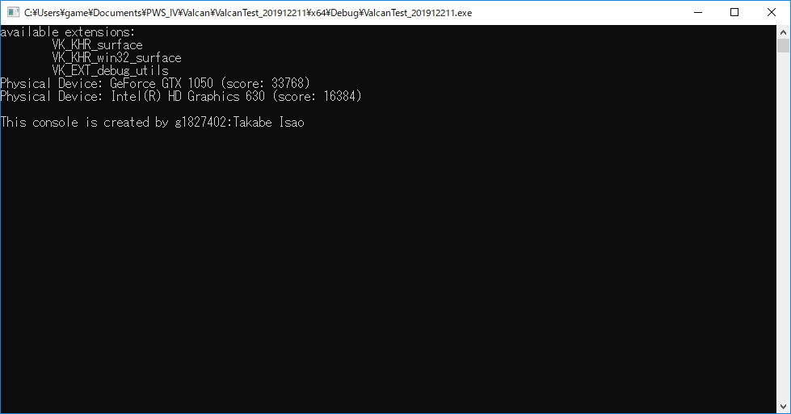

# vulkanの導入

[https://vulkanstudy.github.io/](https://vulkanstudy.github.io/)で勉強を進めます。

論理デバイスの項目まで自分で作成してみてください
（コピーは、ほどほどにしてかまいませんが、丸写しして、将来的に自分の首を絞めるのはやめましょう）。

# 経過画像
# 草を生やす
対応しているvulkanのエクステンションや、キューファミリーの情報を表示してみよう 
 

# 補足
授業で作成したプロジェクトファイルをforkしたプロジェクトに上げてください。

srcフォルダにプロジェクトのファイルを入れてください。
.gitignore を反映させて、無駄なファイルをアップロードしないようにしてください。

工程に応じて、result1.pngファイルを置いてください(表示されることを確認すること)。

翌日以降の提出の際はプルリクを投げてください。
